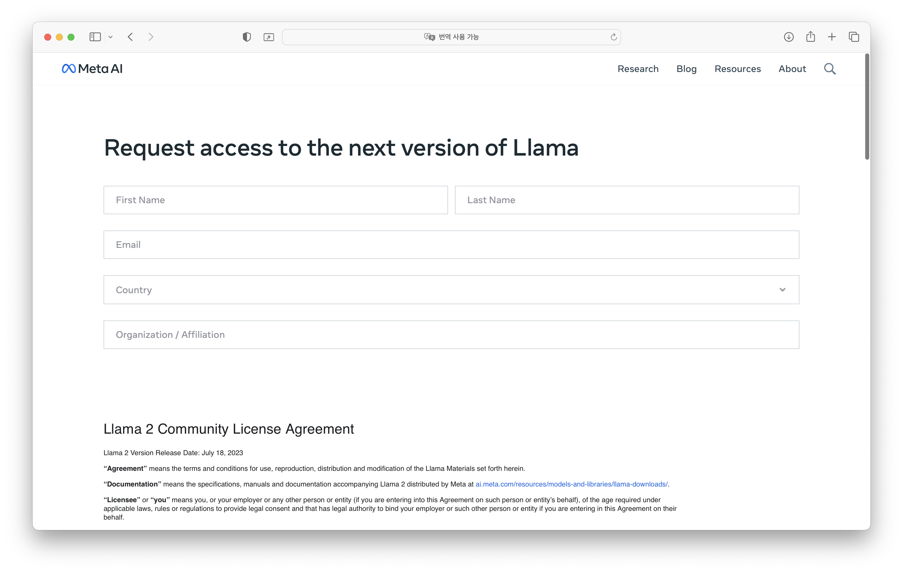
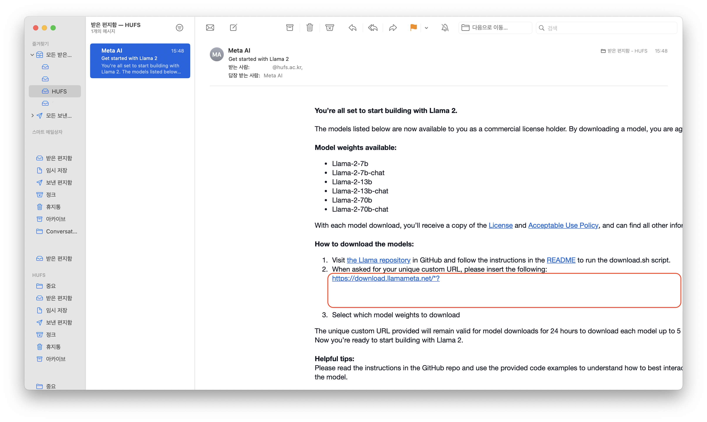
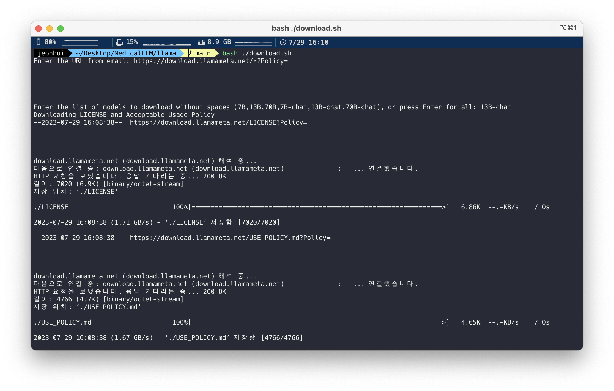

# 의료 관련 질문 답변 LLM
### (NLP, 생성형AI)
### [Notion](https://jeonhui.notion.site/Medical-LLM-4f1496be9ef54d769707b6e0ba30d15d?pvs=4)

## 데이터

> [USMLE](https://www.usmle.org), [PubMed](https://pubmed.ncbi.nlm.nih.gov), Reddit, internet forums, etc

## 참고 자료

<details>
<summary> 보기 </summary>

### **ChatDoctor**

- LLAMA 기반. 채팅으로 진단.
- [youtube](https://www.youtube.com/watch?v=OYhye-jGeKo&ab_channel=빵형의개발도상국)

### [**Comparing Physician vs ChatGPT**](https://scholar.google.com/citations?view_op=view_citation&hl=ko&user=emOpjxAAAAAJ&sortby=pubdate&citation_for_view=emOpjxAAAAAJ:dhFuZR0502QC)

- 환자의 임상적인 질문에 대해서 ChatGPT와 의사의 답변을 비교하여,
누가 더 양질의 & 공감력 높은 답변 하는지 비교
    
- [ComparingPhysicianVsChatGPT.pdf](./papers/ComparingPhysicianVsChatGPT.pdf)
    

### [**ClinicalGPT**](https://arxiv.org/abs/2306.09968)

- [ClinicalGPT.pdf](./papers/ClinicalGPT.pdf)

### **[BiomedGPT](https://arxiv.org/abs/2305.17100)**

- [BiomedGPT.pdf](./papers/BiomedGPT.pdf)

### **[Radiology-GPT](https://arxiv.org/abs/2306.08666)**

- [Radiology-GPT.pdf](./papers/Radiology-GPT.pdf)


</details>

---

## LLaMA2

- 7B, 13B, 70B Model
- 7B-chat, 13B-chat, 70B-chat Model

### [Llama 2 - Meta AI](https://ai.meta.com/llama/)

### [Github](https://github.com/facebookresearch/llama)

### Download

<details>
<summary> 보기 </summary>

**git clone llama**

```shell
git clone https://github.com/facebookresearch/llama
```

**get unique custom URL**





**download model** 

```shell
cd {path}/llama
bash ./download.sh
```

**paste unique custom url**

```plain
Enter the URL from email: {unique custom url}
```

********select model********

```plain
Enter the list of models to download without spaces (7B,13B,70B,7B-chat,13B-chat,70B-chat), or press Enter for all: {selected model}
```

model-list

- 7B, 13B, 70B
- 7B-chat, 13B-chat, 70B-chat



</details>

### 학습 자료

- [**Llama 2 is here - get it on Hugging Face**](https://huggingface.co/blog/llama2)
- [**Colab Tutorial "Getting started”**](https://colab.research.google.com/drive/1uCphNY7gfAUkdDrTx21dZZwCOUDCMPw8?usp=sharing)
- [**Colab Tutorial "Prompt-tune LLaMA-65B for text semantic classification”**](https://colab.research.google.com/github/bigscience-workshop/petals/blob/main/examples/prompt-tuning-sst2.ipynb)